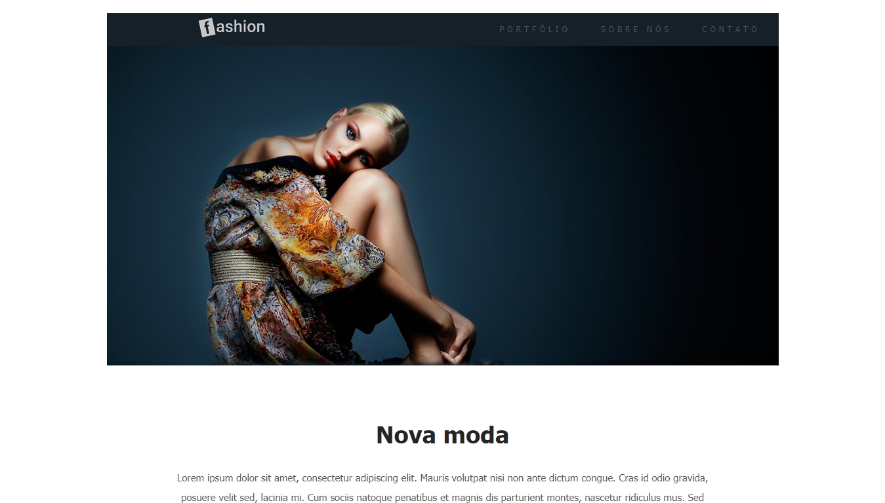
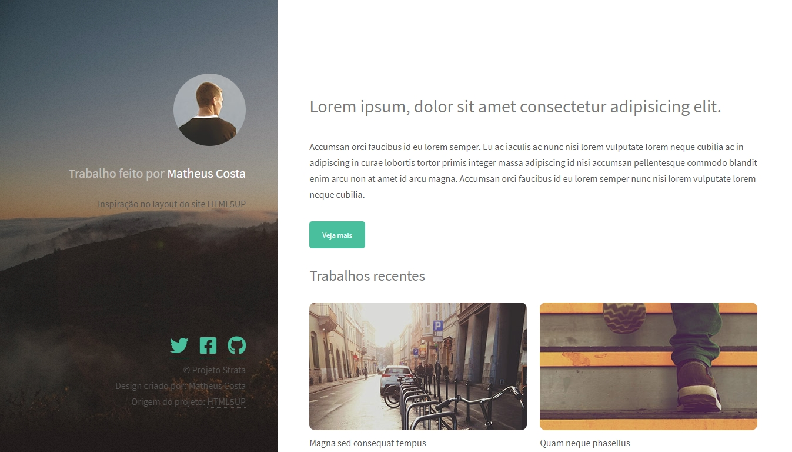
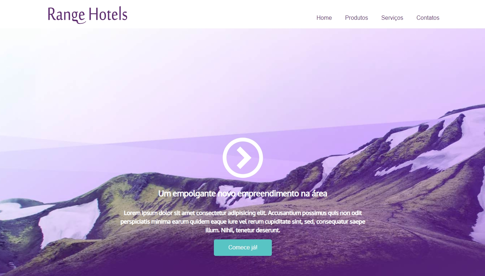
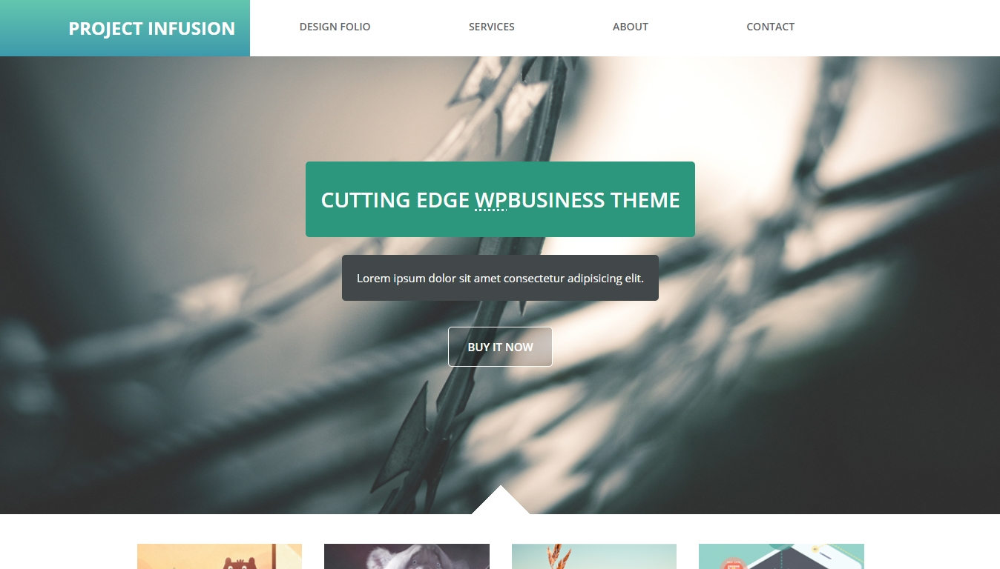

<h1 align="center">:books: Projetos do Curso de Web Design :books:</h1>

<p align="center">Olá! Seja bem-vindo ao meu repositório de projetos realizados durante meu aprendizado no Curso de Web Design da Udemy.
Aqui você irá encontrar os projetos que desenvolvi durante as aulas do curso.</p>

<p align="center"><a href="https://www.udemy.com/course/curso-web-design-fundamentos-aprenda-html-css-e-javascript/">Link do curso</a></p>

<h2 align="center"> :computer: Tecnologias Utilizadas :computer:</h2>

<p align="center">
  
  
  
</p>

<h2 align="center">:rocket: Projetos Desenvolvidos :rocket:</h2>

<details>
  <summary>Fast Fashion</summary>
  <p>Primeiro projeto desenvolvido no curso. Um simples layout de um site de moda.</p>
  
  <p align="center"><a href="https://github.com/matheusz98/projetos-curso-web-design/tree/master/Projeto%20Fast%20Fashion" target="_blank">Fast Fashion</a></p>
</details>

<details>
  <summary>Strata</summary>
  <p>Segundo projeto desenvolvido no curso. Um desafio de recriar um layout do site <a href="https://html5up.net">HTML5UP.</a></p>
  
  <p align="center"><a href="https://github.com/matheusz98/projetos-curso-web-design/tree/master/Projeto%20Strata" target="_blank">Strata</a></p>
</details>

<details>
  <summary>Range Hotels</summary>
  <p>Terceiro projeto desenvolvido no curso. Um site de hotel criado usando layout responsivo.</p>
  
  <p align="center"><a href="https://github.com/matheusz98/projetos-curso-web-design/tree/master/Projeto%20Range%20Hotels" target="_blank">Range Hotels</a></p>
</details>

<details>
  <summary>Infusion</summary>
  <p>Projeto final desenvolvido no curso. Desafio de colocar todo conhecimento adquirido em prática.</p>
  
  <p align="center"><a href="https://github.com/matheusz98/projetos-curso-web-design/tree/master/Projeto%20Infusion" target="_blank">Infusion</a></p>
</details>

<h2 align="center">Curtiu o repositório? Fique a vontade para fazer uso dele! :grin:</h2>

```bash
# Clonar o repositório
$ git clone https://github.com/matheusz98/projetos-curso-web-design

# Ou
# Ir no code (botãozinho verde) e fazer download do zip.

```

<h2 align="center">Muito obrigado pela visita! :smile: :grinning: </h2>

